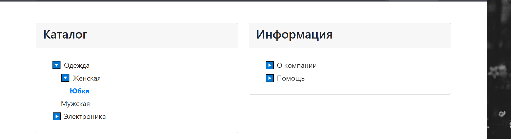

# Древовидное меню на Django

Современное древовидное меню с поддержкой вложенных пунктов для Django-проекта. Меню полностью управляется через Django Admin и поддерживает множественные меню с оптимизированными запросами к базе данных.

---

## Пример интерфейса



---

## Возможности

### Основные функции
- ✅ **Неограниченная вложенность** пунктов меню
- ✅ **Множественные меню** - поддержка нескольких независимых меню
- ✅ **Динамическое подсвечивание** активного пункта меню
- ✅ **Управление через Django Admin** - полный CRUD для меню и пунктов
- ✅ **Оптимизированные запросы** - один SQL-запрос для всех меню
- ✅ **Современный интерфейс** - Bootstrap 5, адаптивный дизайн
- ✅ **JavaScript навигация** - изменение URL без перезагрузки страницы

### Технические особенности
- **Django 4.x** - современная версия фреймворка
- **PostgreSQL** - поддержка продвинутой БД
- **prefetch_related** - оптимизация запросов к базе данных
- **TypeScript-подобная типизация** - с использованием type hints
- **DRY принципы** - переиспользуемые компоненты
- **SOLID архитектура** - чистое разделение ответственности

---

## Установка и настройка

### 1. Клонирование репозитория
```bash
git clone <repository-url>
cd tree_menu-master
```

### 2. Установка зависимостей
```bash
pip install -r requirements.txt
```

### 3. Настройка базы данных
```bash
cd project
python manage.py migrate
```

### 4. Создание суперпользователя
```bash
python manage.py createsuperuser
```

### 5. Запуск сервера
```bash
python manage.py runserver
```

---

## Структура проекта

```
project/
├── app/
│   ├── models.py          # Модели Menu и MenuItem
│   ├── views.py           # Логика отображения меню
│   ├── admin.py           # Админка Django
│   ├── templatetags/      # Кастомные теги шаблонов
│   └── templates/app/     # HTML шаблоны
│       ├── menu_demo.html # Демо-страница
│       └── draw_menu.html # Шаблон отрисовки меню
├── manage.py
└── project/               # Настройки Django
```

---

## Модели данных

### Menu
```python
class Menu(models.Model):
    name = models.CharField(max_length=100)
```

### MenuItem
```python
class MenuItem(models.Model):
    name = models.CharField(max_length=100)
    url = models.CharField(max_length=200, blank=True, null=True)
    parent = models.ForeignKey('self', on_delete=models.CASCADE, null=True, blank=True, related_name='children')
    menu = models.ForeignKey(Menu, on_delete=models.CASCADE, related_name='items')
```

---

## Использование

### 1. Создание меню через админку
1. Перейдите в Django Admin (`/admin/`)
2. Создайте новое меню в разделе "Menus"
3. Добавьте пункты меню в разделе "Menu items"

### 2. Отображение меню в шаблоне
```html

```

### 3. Программное создание меню
```python
from app.models import Menu, MenuItem

# Создание меню
menu = Menu.objects.create(name='Главное меню')

# Создание пунктов
parent = MenuItem.objects.create(
    name='Категории',
    url='/categories/',
    menu=menu
)

child = MenuItem.objects.create(
    name='Электроника',
    url='/categories/electronics/',
    parent=parent,
    menu=menu
)
```

---

## API и функции

### render_menu(menu_name: str, request) -> str
Рендерит HTML-код меню по его названию.

### menu_demo(request)
Отображает демо-страницу со всеми меню.

### build_menu_tree(menu_items, current_url, parent=None) -> List[Dict]
Строит древовидную структуру меню с определением активного пункта.

---

## Оптимизация производительности

### Запросы к базе данных
- **До оптимизации**: N+1 запросов (1 для меню + N для пунктов)
- **После оптимизации**: 1 запрос для всех данных
- **Используется**: `prefetch_related('items__parent', 'items__menu')`

### Пример оптимизированного запроса
```python
menus = Menu.objects.prefetch_related(
    'items__parent',
    'items__menu'
).all()
```

---

## Особенности реализации

### JavaScript функциональность
- Изменение URL без перезагрузки страницы
- Динамическое подсвечивание активного пункта
- Поддержка кнопок браузера "Назад"/"Вперед"
- Обработка событий `popstate`

### CSS стилизация
- Адаптивный дизайн с Bootstrap 5
- Кастомные стили для меню
- Подсветка активных элементов
- Hover-эффекты

---

## Требования

- Python 3.8+
- Django 4.x
- PostgreSQL (рекомендуется)
- Bootstrap 5 (CDN)

---

## Лицензия

MIT License

---

## Автор

Разработано с использованием современных принципов разработки и лучших практик Django.